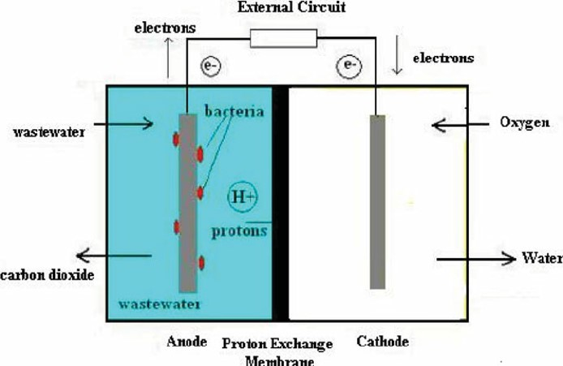

### Introduction
Rapid technological advancements in the modern era have accelerated the depletion of non-renewable resources and exacerbated urgent environmental degradation challenges, particularly in wastewater treatment. Ecosystems and human health are seriously threatened by wastewater in the environment. Wastewater that has been left untreated or mishandled can introduce some contaminants, such as nutrients, pathogens, heavy metals, medications, and organic compounds, into groundwater, rivers, lakes, or the ocean. These contaminants may negatively affect aquatic life, causing decreased biodiversity, algal blooms, reduced oxygen levels, and habitat deterioration. Adequate wastewater treatment is essential to mitigate the adverse impacts of wastewater on the environment. Microbial Fuel Cell (MFC) technology emerges as a promising solution, offering a sustainable approach by concurrently recovering energy and nutrients to generate bioelectricity. MFCs take advantage of the capacity of electrogenic microorganisms to oxidise organic contaminants found in wastewater.
&nbsp;

### Theory
Microbial fuel cells (MFCs) are one of the newer methods that can be used to meet the demand to treat wastewater and produce energy. Microbial fuel cells (MFCs) are innovative bio-electrochemical systems that harness the metabolic activity of microorganisms to convert organic matter directly into electrical energy. The principle behind MFCs for wastewater treatment involves using bacteria to oxidise organic pollutants in wastewater while simultaneously generating electricity. The main principle behind using microbial fuel cells for wastewater treatment is using bacteria to break down organic contaminants in sewage, simultaneously producing electrical energy through electron transfer processes. This technique could be environmentally friendly in treating wastewater and producing renewable energy.

The anode, cathode, and proton exchange membrane (PEM) separating the two electrodes are the fundamental parts of an MFC. Wastewater is fed into the anode chamber, where bacteria, usually electrochemically active microorganisms like Shewanella species or Geobacter, consume it as a carbon source. As a result of bacterial metabolism, electrons are released throughout this process. An electric current is produced when the liberated electrons are transported to the anode surface. Protons, positively charged ions created by bacterial metabolism, move through the electrolyte solution and towards the cathode. Water or another reduced product is made at the cathode when protons and electrons interact with oxygen or another electron acceptor. The flow of electrons produced by bacterial metabolism can be caught as electrical energy and stored for later use, or it can be used to power other devices by connecting an external circuit between the anode and cathode.

&nbsp;

Fig.1: Schematic representation of a Microbial Fuel cell for Wastewater Treatment.

Adapted from: Mathuriya, A. S. (2014). Eco-affectionate face of microbial fuel cells. Critical Reviews in Environmental Science and Technology, 44(2), 97-153.

&nbsp;

### Factors influencing the efficiency of Microbial Fuel Cells (MFCs) in wastewater Treatment.

#### 1.	Microbial community or Strength of Wastewater (BOD): 
The diversity of the microbial community within the MFC plays a crucial role in organic matter degradation and electron transfer processes. Optimal microbial consortia containing electrogenic bacteria are essential for efficient MFC operation. Understanding the strength of wastewater (in mg/l) or Biological Oxygen Demand (BOD) interacting with MFC is crucial for determining the efficiency of microbial fuel cells. Higher BOD values indicate higher quantities of biodegradable organic compounds in wastewater, which is one vital indicator of organic pollution. MFCs show improved treatment efficiency in wastewater with high BOD levels, efficiently eliminating organic pollutants while generating electrical energy simultaneously. MFCs demonstrate resilience to variations in BOD levels, ensuring consistent performance over an extended period and providing a sustainable option for energy recovery and wastewater treatment in various environmental conditions.

#### 2.	Proton Exchange Membrane: 
Proton exchange membranes (PEMs) are essential components of Microbial Fuel Cells, facilitating proton transport between the anode and cathode compartments while preventing the crossover of reactants and products. Various types of PEMs have been developed and utilised in MFCs, and they have unique properties and advantages. Using Bacillus subtilis as an electrogenic microbe, nutrient agar as a growth medium, and Nafion as a proton exchange membrane in Microbial Fuel Cells (MFCs) offers a potential approach to wastewater treatment and sustainable bioenergy generation. Bacillus subtilis is a Gram-positive bacterium that can transmit electrons to external electron acceptors. It grows well in a medium that contains nutrients. Bacillus subtilis metabolises organic substrates in wastewater in an MFC setup by developing a biofilm on the agar surface, which allows direct electron transfer to the anode. Dividing the anode and cathode compartments with a Nafion proton exchange membrane enables effective proton transport while reactant and other ions are kept from crossing. This arrangement makes producing electrical energy through electrochemical reactions possible, a potential way to meet energy needs and reduce environmental pollution.

#### 3.	Electrode Material: 
Electrode material selection is a crucial aspect influencing the performance of Microbial Fuel Cells (MFCs) in wastewater treatment. Carbon-based electrodes are widely utilised in MFCs due to their excellent electrical conductivity, chemical stability, and high surface area, facilitating efficient electron transfer and maximising electricity generation. 
##### •	Anode: 
Graphite, aluminium, manganese, and stainless steel are commonly used as anode elements in Microbial Fuel Cells (MFCs). Graphite electrodes provide excellent electrical conductivity, chemical stability, and biocompatibility, making them ideal for facilitating efficient electron transfer and biofilm formation. Aluminium anodes offer affordability and lightweight properties but may face challenges with corrosion and passivation in the acidic MFC environment. Manganese-based materials, such as manganese dioxide, exhibit good catalytic activity and environmental sustainability, presenting promising alternatives for MFC electrodes. Stainless steel anodes provide durability and corrosion resistance, although their biocompatibility and electron transfer kinetics may require further optimisation for optimal MFC performance. The selection of anode material depends on factors such as cost, conductivity, stability, and suitability for specific MFC applications, highlighting the ongoing need for research and development in advancing MFC technology.

##### •	Cathode: 
Graphite and copper are common cathode elements in Microbial Fuel Cells (MFCs) for efficient electricity generation in wastewater treatment. Graphite cathodes, known for their excellent electrical conductivity, chemical stability, and biocompatibility, provide an ideal surface for oxygen reduction reactions (ORR), maximising electricity generation. On the other hand, copper cathodes offer good conductivity and catalytic activity for ORR, potentially providing a cost-effective option for MFC applications. However, copper electrodes may face corrosion challenges in the alkaline environment of MFCs. The selection of cathode material depends on factors such as performance requirements, cost considerations, and suitability for specific MFC applications. This underscores the ongoing need for research and development in optimising cathode materials and designs to enhance MFC performance and advance sustainable wastewater treatment technologies.

#### 4.	Electrolyte Selection: 
The electrolyte in a MFC plays a crucial role in facilitating ion transport, maintaining electrochemical balance, and supporting microbial activity, thus influencing the performance and efficiency of the system. Using potassium permanganate (KMnO4) and water as catholyte in Microbial Fuel Cells (MFCs) offers an innovative approach to enhance electricity generation and wastewater treatment. Potassium permanganate, a potent oxidising agent, is an electron acceptor at the cathode, undergoing reduction reactions to produce manganese dioxide (MnO2) and oxygen. In this configuration, water acts as the solvent for potassium permanganate, facilitating its dissolution and participation in electrochemical reactions. As electrons flow from the anode to the cathode through an external circuit, they reduce potassium permanganate to MnO2, generating electrical energy. This process enables simultaneous wastewater treatment by oxidising organic pollutants in the catholyte. Additionally, using potassium permanganate and water as catholyte minimises the need for costly or complex cathode materials, offering a simple and effective solution for MFC applications.

#### 5.	Time Duration: 
The time taken for treating wastewater in a double-chambered MFC is crucial for dictating the overall system performance. This parameter influences various critical aspects of MFC operation, including microbial activity and metabolism, biofilm formation and stability, substrate utilisation and removal, and the optimisation of treatment processes. A longer residence time allows for extended contact between wastewater and electrogenic microorganisms, facilitating more thorough degradation of organic pollutants and promoting the generation of electrical current. By carefully controlling the time duration and balancing it with other operational parameters, dual-chamber MFC systems can achieve high treatment efficiencies, effectively mitigate environmental pollution, and generate sustainable energy from organic waste streams.

