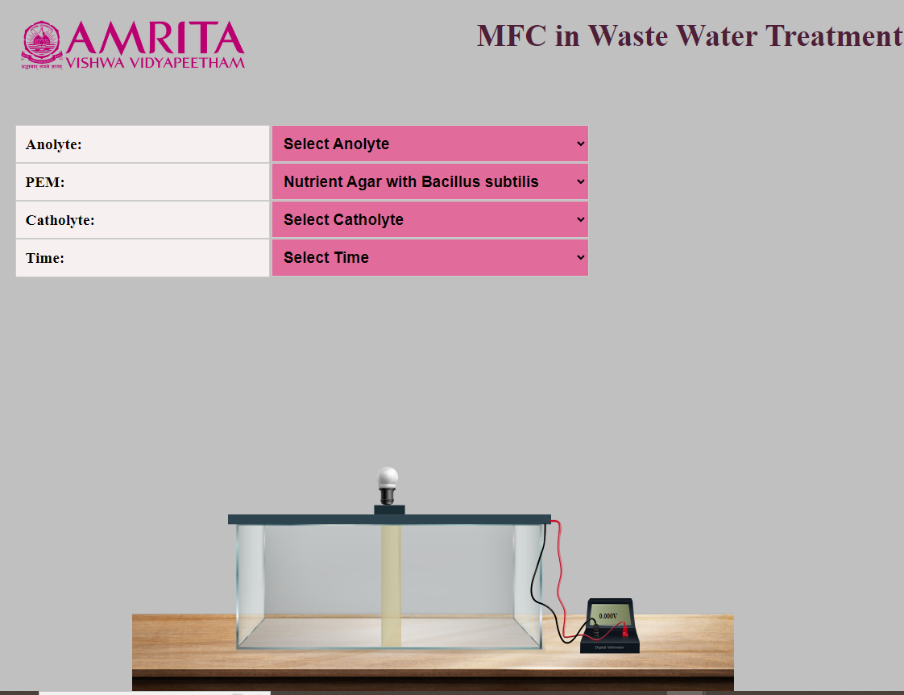
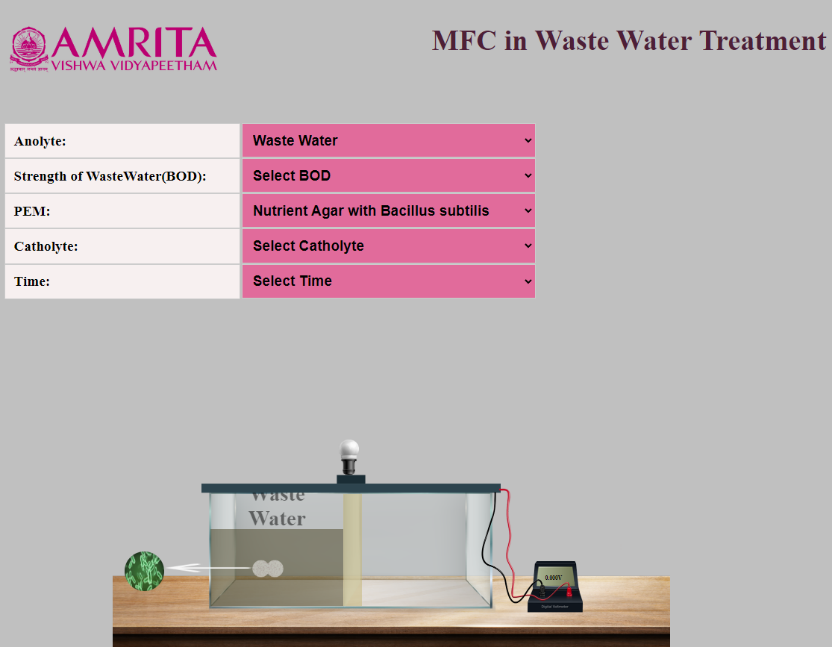
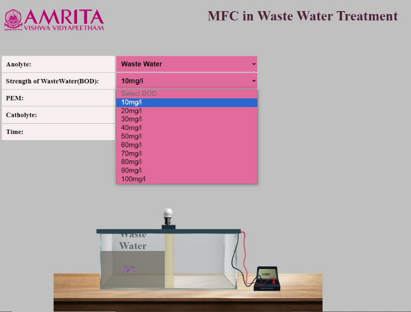
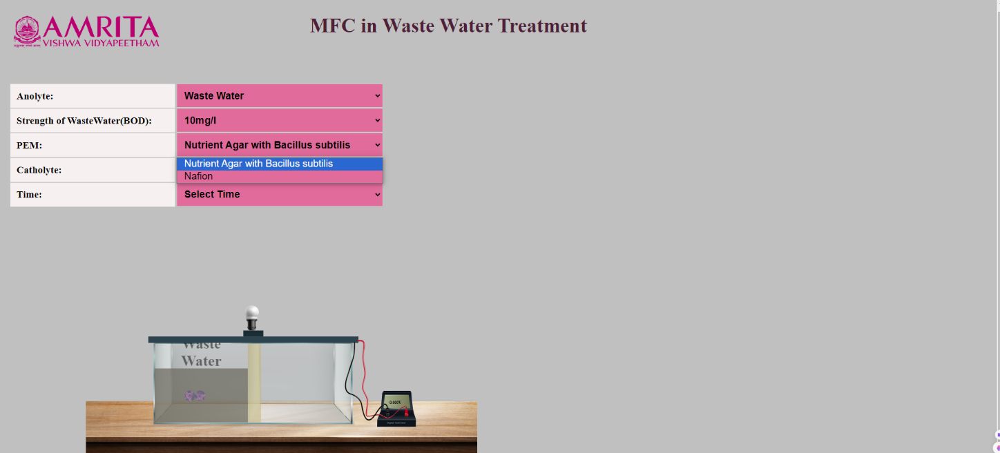
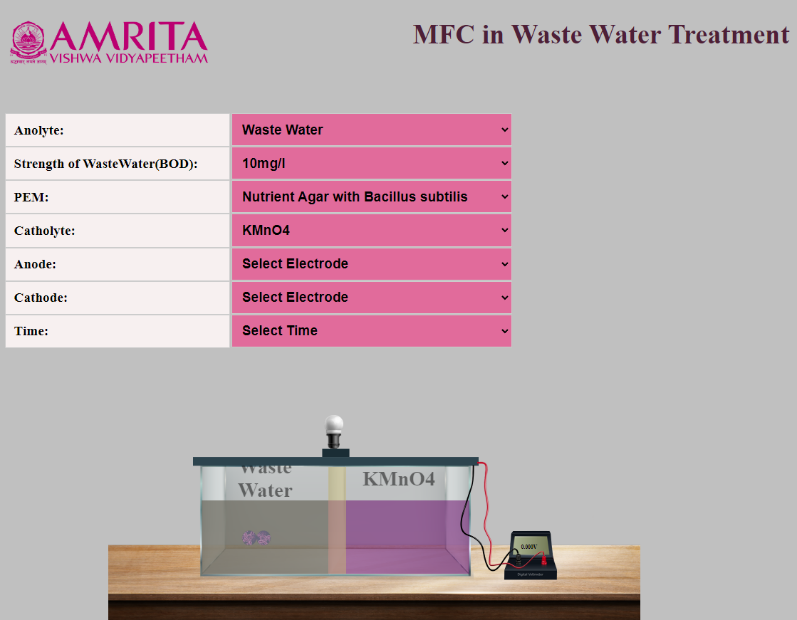
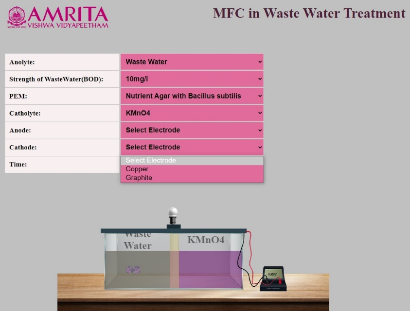
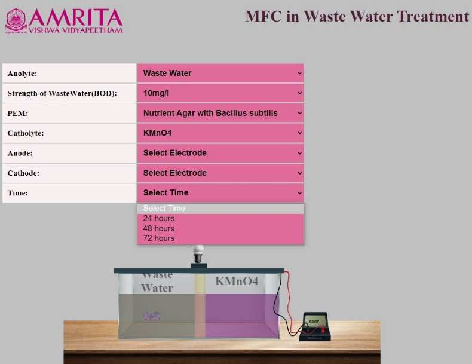
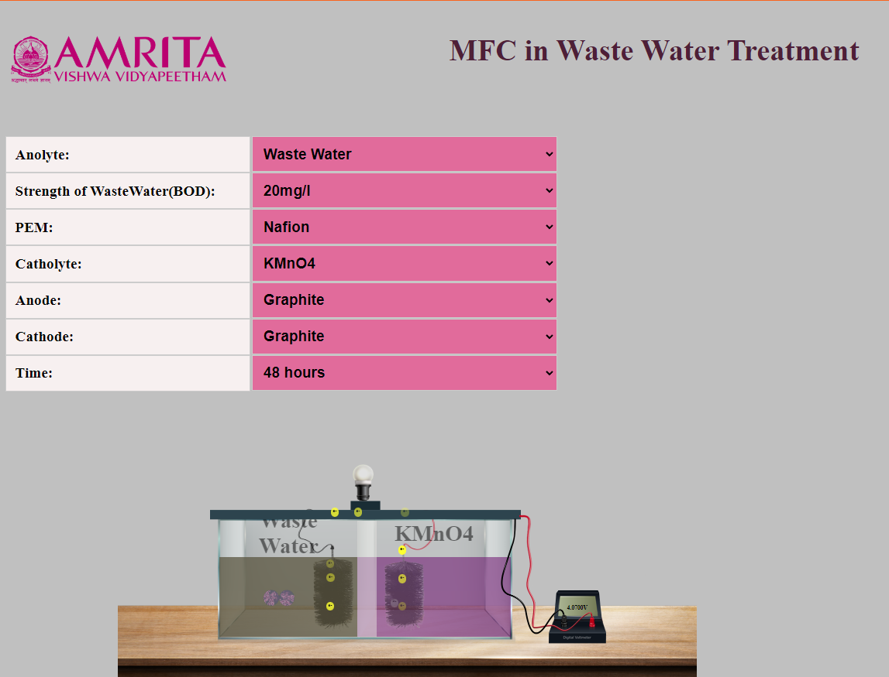

### Procedure

1) Users can open the simulator window. The GUI has selection choices for input parameters such as Anolyte selection, PEM selection, and catholyte selection and time. Users can change the parameters by clicking on the specific tabs. In this experiment, parallel connections of MFC chambers are visualised. MFC is connected to a voltmeter to measure the voltage, and a bulb is connected to show bioelectricity production.

   

&nbsp;

2) In the simulator, the anolyte is wastewater. Once the user selects the wastewater, another parameter will show for sewage strength (BOD) selection. Users can provide the BOD concentration from a range of 10-100mg/l.

   
  
   &nbsp;

   

&nbsp;

3) The GUI has two options for PEM selection: Nutrient agar with Bacillus Subtilis and Nafion. Users can select their choice of parameter.

   

&nbsp;

4) The GUI has two options for Catholyte selection: KMnO4 and water. Users can select their choice of parameter. Once the user selects their preferred catholyte, the electrode selection (Anode and Cathode) tab will pop up. GUI provides anode materials such as Aluminium, manganese, Graphite, and stainless steel. Similarly, cathode materials as copper and graphite.

   
  
    &nbsp;
  
   
  
    &nbsp;
  
   

&nbsp;

5) In the simulator, the user can adjust the sewage treatment time in MFC from a range of 24Hrs to 72 Hrs by clicking on the Time tab.

   

&nbsp;

6) To work out the simulator, as an example, Anolyte is selected as wastewater, the strength of wastewater (BOD) as 20mg/l, PEM as Nafion, Catholyte as KMnO4, anode and cathode materials as Graphite, and the time duration is 48 Hrs. The electrode selection and the transfer of electrons from the anodic chamber to the cathodic chamber can be visible in the GUI. Also, an enlarged representation of bacterial content is visible when clicking on the bacteria shown in the anodic chamber in the simulator. After selecting the input parameters, users can observe the bulb's glow connected to the MFC, representing the bioelectricity production, and the voltage can be read as 4.0700 V.

   

&nbsp;

*Note: In the MFC system of wastewater treatment, the bioelectricity production is directly proportional to the strength of wastewater or BOD, carbon-based electrode material, and the duration of treatment of the sewage. So, an increased value of electricity production is observed in the simulator by changing the above-mentioned parametric values*
